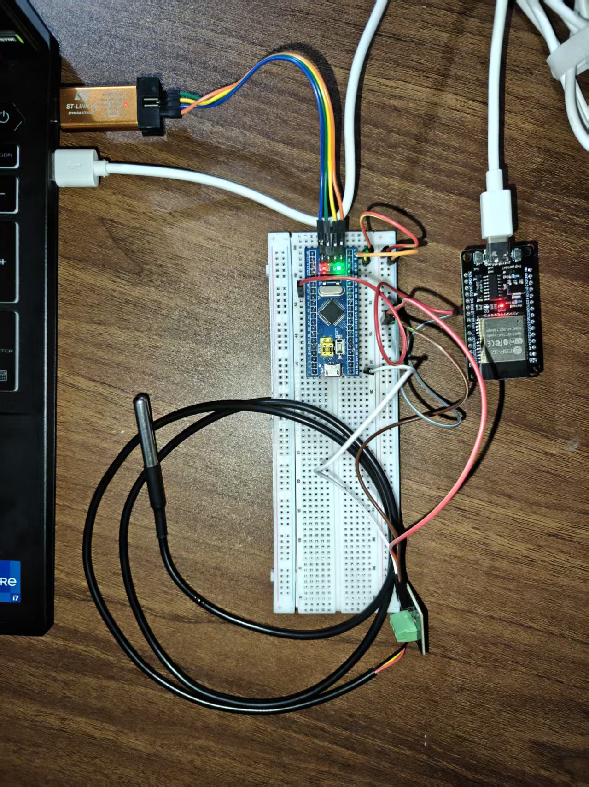

# TempMonitor — DS18B20 无线温度监控系统

[]()
[]()
[]()
[]()

基于 STM32F103C8T6 + ESP32 + DS18B20 防水探头的嵌入式实时温度监控系统。STM32 采集温度，ESP32 自建 WiFi 热点，手机 APP 直连查看。

---

## 📖 项目简介

系统采用双芯片架构——STM32 负责传感器采集，ESP32 负责 WiFi + HTTP 服务。两根杜邦线完成串口通信，手机连接 ESP32 热点即可查看实时温度，无需路由器。

## 🎯 核心功能

-  **DS18B20 防水探头** — 12-bit 精度 ±0.5°C，可浸入水中测温
-  **双芯片分工** — STM32 专注传感器采集，ESP32 专注 WiFi 通信，职责清晰
-  **无需路由器** — ESP32 自建 WiFi 热点 `TempMonitor`，手机直连即可
-  **Android APP** — 实时温度、折线图、MAX/MIN 记录、水温/气温模式切换、超阈值红色报警
-  **RESTful API** — `GET /temp` 返回 JSON，方便二次开发
-  **手写 OneWire 协议** — 从寄存器层面驱动 DS18B20，不依赖第三方库
-  **协作式轮询** — 不用 RTOS，基于 DWT 计数的轻量级任务调度

## 🏗️ 系统架构

```
DS18B20 ──OneWire──► STM32F103C8T6 ──USART2──► ESP32 ──WiFi AP──► 手机 APP
   ↑                     ↑                        ↑
 防水探头             72MHz 裸机              Arduino 框架
 PB12, 4.7kΩ上拉     协作式轮询              HTTP Server :80
```

| 芯片 | 职责 | 工具链 |
|------|------|--------|
| STM32F103C8T6 | DS18B20 温度采集，每秒发送数据 | Keil MDK-ARM v5 |
| ESP32 | 串口接收、WiFi AP、HTTP API | Arduino IDE |

## 📊 数据流

```
DS18B20 → STM32 (OneWire) → USART2(PA2) → ESP32 GPIO16 → WiFi → /temp API → APP
  12-bit ADC        printf("T:25.3\r\n")     115200bps      HTTP JSON
  750ms 转换
```

---

## 🚀 快速开始

### 所需硬件

| 组件 | 数量 | 备注 |
|------|------|------|
| STM32F103C8T6 最小系统板 | 1 | Blue Pill 或类似 |
| ESP32 DevKit 开发板 | 1 | CH340 版本即可 |
| DS18B20 防水探头 | 1 | TO-92 封装 + 不锈钢探头 |
| 4.7kΩ 电阻 | 1 | OneWire 上拉 |
| ST-Link 下载器 | 1 | 烧录 STM32 |
| 杜邦线、面包板 | 若干 | — |

### 硬件接线

**STM32 端**

| STM32 引脚 | 连接 |
|-----------|------|
| PB12 | DS18B20 DQ（4.7kΩ 上拉到 3.3V） |
| PA2 (USART2_TX) | ESP32 GPIO16 |
| GND | ESP32 GND（共地） |

**DS18B20 防水探头**

| 线色 | 连接 |
|------|------|
| 红 | 3.3V |
| 黄 | PB12 |
| 黑 | GND |

### 编译与烧录

**STM32（Keil MDK）**

1. 打开 `firmware/Project/TempMonitor.uvprojx`
2. F7 编译 → F8 烧录（ST-Link）

**ESP32（Arduino IDE）**

1. 打开 `esp32_receiver/esp32_receiver.ino`
2. 选择板子 `ESP32 Dev Module` → 上传

### 使用

1. STM32 和 ESP32 上电
2. 手机连接 WiFi `TempMonitor`（密码 `12345678`）
3. 打开 APP → 实时温度显示

---

## 📁 项目结构

```
TempMonitor/
├── firmware/                          # STM32 Keil5 工程
│   ├── User/                          # 用户源文件
│   │   ├── main.c                     # ★ 主程序
│   │   ├── ds18b20.c / ds18b20.h      # DS18B20 OneWire 驱动
│   │   ├── onewire.c / onewire.h      # 1-Wire 底层协议
│   │   ├── delay.c / delay.h          # DWT 微秒级延时
│   │   ├── usart.c / usart.h          # USART1+USART2 串口驱动
│   │   ├── spi.c / spi.h              # SPI 驱动
│   │   ├── nrf24l01.c / nrf24l01.h    # NRF24L01 驱动（实验）
│   │   └── stm32f10x_conf.h           # 标准外设库配置
│   └── Project/                       # Keil 工程文件
├── esp32_receiver/                    # ESP32 Arduino 代码
│   └── esp32_receiver.ino             # ★ 串口接收 + WiFi AP + HTTP API
├── android_app/                       # Android APP (Android Studio)
│   └── app/src/main/
│       ├── java/com/tempmonitor/
│       │   ├── MainActivity.java      # 主界面
│       │   ├── TempService.java       # HTTP 轮询线程
│       │   ├── ChartView.java         # 温度曲线自定义 View
│       │   └── TempDescHelper.java    # 水温/气温模式描述
│       └── res/layout/
│           └── activity_main.xml      # 界面布局
├── app/                               # Python PC 端调试工具
│   ├── main.py
│   ├── serial_handler.py
│   └── ui.py
├── docs/                              # 文档 & 演示
│   ├── images/hardware.jpg            # 硬件连接图
│   ├── app_demo.mp4                   # APP 演示视频
│   └── debug_test.mp4                 # 调试检测视频
├── .gitignore
└── README.md
```

## 📸 项目演示

**硬件连接图**



**手机 APP 测温效果展示**

[▶ 点击查看视频](docs/app_demo.mp4)

**串口数据验证**

[▶ 点击查看视频](docs/serial_test.mp4)

### 📱 APP 安装包

[📥 下载 TempMonitor APK](TempMonitor.apk)

---

## 🔌 API 参考

### GET /temp

返回最新温度读数，CORS 已开启。

```
GET http://192.168.4.1/temp
```

**Response 200 OK:**

```json
{
  "temperature": 26.3
}
```

### GET /

打开 Web 仪表盘，浏览器中实时显示温度。

---

## 🧠 技术细节

### OneWire 时序实现

DS18B20 需要微秒级精确时序（1-480μs）。用 ARM Cortex-M3 的 DWT（Data Watchpoint and Trace）周期计数器实现 `Delay_us()`——72MHz 主频下每周期 ≈ 14ns，1μs = 72 个计数周期。精度优于 HAL_Delay() 的毫秒级分辨率。

```c
void Delay_us(uint32_t nus) {
    uint32_t start = DWT->CYCCNT;
    uint32_t ticks = nus * (SystemCoreClock / 1000000);
    while ((DWT->CYCCNT - start) < ticks);
}
```

### 时钟树配置

```
HSE 8MHz → PLL (×9) → SYSCLK 72MHz
                          ├── AHB  72MHz
                          ├── APB2 72MHz (USART1, GPIO)
                          └── APB1 36MHz (USART2, USART3)
```

USART2 波特率：115200bps（APB1 36MHz，USARTDIV = 19.53125，误差 0.16%）

### 为什么不用 RTOS

系统只有两个周期性任务——读传感器（~800ms）和发串口（1s）。协作式轮询基于 `DWT->CYCCNT` 时间戳判断，零 ROM/RAM 开销，不需要抢占式调度器。

### 串口协议

```
STM32 → ESP32:  "T:25.3\r\n"   （ASCII 文本，115200, 8N1）
ESP32 → Phone:  {"temperature":25.3}  （HTTP JSON）
```

---

## 🔧 NRF24L01 无线扩展

系统最初设计为 NRF24L01 全无线方案：

```
STM32 → NRF24L01(TX) → 空中 → NRF24L01(RX) → ESP32 → WiFi → APP
```

-  STM32 端 NRF24L01 发射驱动已验证正常（SPI1 + 硬件 SPI）
-  STM32 双 NRF 模块互通测试通过（TX 发 `AA XX YY 55`，RX 收 `AA XX YY 55`）
-  ESP32 端 NRF24L01 接收存在 SPI 通信不稳定问题（根因：GPIO 驱动能力 + 缺近端去耦电容）

NRF 驱动代码保留在 `firmware/User/nrf24l01.c`，后续可换 Arduino Nano 接收端切回纯无线。

## 📄 License

MIT
